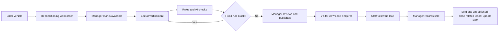

> Superseded v1.0 historical draft. Do not implement from this document. Read the current document index in [README.md](README.md) for the 00 business design and the 07/08/09 microservice, DevOps, and AI component designs. The original requirements have been located and verified; they do not include a manufacturer portal or a buyer self-service site.

# Workflows and screens

## Main business flow

An advertisement draft may be prepared during reconditioning, but the vehicle must be AVAILABLE to publish. A sale may come from a staff-entered manual lead without a prior public publish; the vehicle must still be AVAILABLE.

## State design

### Vehicle

- New: PREPARING.
- PREPARING → AVAILABLE: Manager; all work orders DONE/CANCELLED; ready note filled.
- AVAILABLE → PREPARING: Manager; used to add further reconditioning; atomically unpublish the advertisement, increment advertisement content version, and void old checks.
- AVAILABLE → SOLD: triggered only by the sale transaction.
- PREPARING/AVAILABLE → ARCHIVED: Manager; requires no in-progress work orders and no NEW/CONTACTED/QUALIFIED leads; atomically unpublish the advertisement. If dependencies exist, finish/cancel work orders and close leads first.
- SOLD and ARCHIVED are terminal in this version; there is no undo, restock, or restore. Reopening is a future requirement.

New work orders are allowed only in PREPARING. An already-available vehicle must return to preparation first, so a public advertisement cannot disagree with vehicle status.

### WorkOrder

OPEN → IN_PROGRESS → DONE; OPEN/IN_PROGRESS may go to CANCELLED. DONE/CANCELLED are no longer edited; a wrong task may be replaced by a new work order. Marking DONE requires a completion note; cost may be 0.

### Listing

DRAFT → PUBLISHED: manager passes the current-version check and confirms; PUBLISHED → DRAFT: manual unpublish, vehicle returns to preparation, or advertisement-related content is changed; DRAFT/PUBLISHED → CLOSED: vehicle sold or archived.

Do not store a separate “reviewed” status. The UI uses whether the latest check matches contentVersion to show “not yet checked”, “needs re-check”, “has blockers”, or “ready for review”. That avoids an explosion of crossed listing and check states.

Advertisement-related content includes title, description, vehicle make/model/year/mileage, price/fees, demo image, and scope fields. A change increments contentVersion by 1 and clears the current publish confirmation. Changes to internal notes, work-order notes, and customer records alone do not affect advertisement version.

### Lead

NEW → CONTACTED → QUALIFIED; NEW/CONTACTED/QUALIFIED may all go to LOST, and a reason is required. CONTACTED/QUALIFIED may return to NEW or CONTACTED, but a note is required.

WON can be set only by the sale transaction. LOST/WON are terminal; there is no reopen. If the customer later wants another vehicle, create a new lead and attach the existing customer.

## Key exceptions

1. Price change after a check: the old check is kept as history; the new version is unchecked; publish returns CHECK_STALE.
2. Draft edited while AI is running: the check still targets the original snapshot and returns that historical result; the current UI says a re-run is required and it cannot be used to publish the new draft.
3. AI cannot connect: fixed-rule results remain visible; AI shows UNAVAILABLE; a manager may confirm a degraded publish only when there is no BLOCK, and must fill a note.
4. Stale page: write requests carry version; conflict returns 409, keeps the user’s input, and asks for a refresh-and-compare.
5. Vehicle just sold while a visitor still has the old page open: enquiry submit re-checks status on the server, returns 409, and says the vehicle is no longer available for enquiry.
6. Two competing sales: the same vehicle row is locked and serialized; the later request returns VEHICLE_NOT_AVAILABLE and creates no orphan sale.
7. New work order during publish: new work orders require PREPARING; return-to-preparation and publish both lock the vehicle, so “in reconditioning and published” cannot be created concurrently.

## Screens and low-fidelity layout

Use left navigation + top account area + main content. Prefer drawer or in-detail editing over many standalone pages. Fixed English navigation: Dashboard, Vehicles, Work Orders, Leads, Sales.

### P01 Login · /login

Centered login card: Email, Password, Sign in. Errors only say the account or password is incorrect. Loading prevents double-click; after sign-in go to Dashboard.

### P02 Dashboard · /app

Five compact top metrics: Available vehicles, Open work orders, Open leads, Sales this month, Recorded sales amount. Below: Today’s follow-ups and Open work orders, at most 5 each, clickable to the record. Leads with no follow-up date are not overdue.

### P03 Vehicles · /app/vehicles

Top: Search (stock number/VIN/make/model), Status, Add vehicle.
List: Stock #, Vehicle, Mileage, Advertised price, Status, Listing status, View.
Create and edit share one form. Numbers include units km and CAD; mandatory fees are entered separately; display total is calculated by the backend.

### P04 Vehicle detail · /app/vehicles/:id

Top: vehicle summary and status. Four tabs: Overview, Preparation, Advertisement, Related leads.

Overview: vehicle fields, internal note, Manager Mark available / Return to preparation / Archive.
Preparation: work-order list, Add work order, update work-order status.
Advertisement: two columns — edit on the left, preview and check panel on the right. Top shows Draft version; buttons Save, Run checks, Publish/Unpublish. Each finding shows field, reason, and suggestion; the Manager publish dialog shows check id, current version, acknowledgements, and a note box.
Related leads: customer name, owner, stage, next follow-up, view detail.

Advertisement structure is always: vehicle title → price and tax/licence note → vehicle specs → free description → dealer name and contact → Enquire. Fixed disclosures are not hidden in a collapsed section.

### P05 Work Orders · /app/work-orders

Filter by status/assignee; show related vehicle, task, due date, status, and cost. Updates use a drawer; there is no calendar scheduler.

### P06 Leads · /app/leads

Use a list, not a drag-and-drop board. Filters: Stage, Owner, Overdue; Add lead allows an existing customer or a new customer plus one AVAILABLE vehicle.
List shows customer, vehicle of interest, stage, owner, next follow-up. New visitor leads default to empty owner; Manager may assign; all staff can read/write the shared CRM.

### P07 Lead detail · /app/leads/:id

Left: customer profile, vehicle of interest, stage, owner, next follow-up date.
Right: time-ordered follow-up notes, Add note (channel PHONE/EMAIL/VISIT/OTHER, content, next date). Only record contacts that already happened; do not send email.
Manager Record sale opens a sale confirmation: customer, vehicle, sale amount, note; warn that the vehicle will be unpublished and other leads closed. After WON/LOST the record is read-only.
Editing a customer affects all of that customer’s leads; the confirm dialog says so. Visitors are not auto-merged by email, to avoid merging different people.

### P08 Sales · /app/sales

Filter by sale month; show sale number, vehicle, customer, recorder, amount, time. Click for a read-only sale snapshot. MVP has no delete, refund, or undo.

### P09 Public inventory · /inventory

Vehicle cards: demo image, make/model/year, mileage, price, and public contact. Only PUBLISHED and AVAILABLE. Filter by make and price range; empty results have a clear explanation.

### P10 Public vehicle · /inventory/:listingId

Full advertisement and enquiry form: Name, Email, Phone, Message; at least one contact method. Copy says the message will be given to the dealer; other enquiries are not shown. Success shows a short confirmation; do not return internal customerId, leadId, or contact details.

## Shared interaction

- Lists must have loading, empty, error, and pagination; default 20 per page.
- Amounts display CAD; times display dealer timezone America/Toronto; the server stores UTC.
- Failed save keeps input; field errors show in place; state conflicts offer a refresh action.
- Dangerous business actions use an explicit object and outcome, for example “Record sale for DEMO-001”.
- The advertisement page shows “Checks cover selected rules; manager review required” and does not use an “OMVIC certified” mark.
