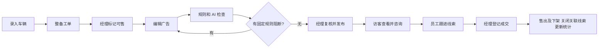

> 已废止的 v1.0 历史稿，不据此编码。请从 [当前文档索引](README.md) 阅读 00 业务设计与 07/08/09 微服务、DevOps、AI 组件设计。原始需求已找到并核实，不包含厂家或买家自助端。

# 流程与页面

## 主业务流程

广告草稿可在整备期间准备，但必须 AVAILABLE 才能发布。成交可来自员工手动录入的线索，无须先公开发布，车辆仍必须 AVAILABLE。

## 状态设计

### Vehicle

- 新建：PREPARING。
- PREPARING → AVAILABLE：Manager；所有工单 DONE/CANCELLED；填写 ready note。
- AVAILABLE → PREPARING：Manager；用于追加整备；原子下架广告，增加广告内容版本，使旧检查失效。
- AVAILABLE → SOLD：只由成交事务触发。
- PREPARING/AVAILABLE → ARCHIVED：Manager；要求没有进行中工单、没有 NEW/CONTACTED/QUALIFIED 线索，原子下架广告。若有依赖，先完成/取消工单及关闭线索。
- SOLD 和 ARCHIVED 为本版终态，不做撤销、重新进货或恢复。需要重开时作为以后需求。

新增工单只允许 PREPARING。已可售车辆必须先回整备，避免公开广告和车辆状态不一致。

### WorkOrder

OPEN → IN_PROGRESS → DONE；OPEN/IN_PROGRESS 可转 CANCELLED。DONE/CANCELLED 不再编辑，错误任务可新建替代工单。标记 DONE 要求完成备注，成本允许 0。

### Listing

DRAFT → PUBLISHED：经理通过当前版本检查并确认；PUBLISHED → DRAFT：人工下架、车辆回整备，或修改广告相关内容；DRAFT/PUBLISHED → CLOSED：车辆售出或归档。

不用单独存“已审核”状态。界面根据最近检查与 contentVersion 是否一致，显示“尚未检查”“需重新检查”“有阻断”“可复核”。这避免广告状态与检查状态交叉爆炸。

广告相关内容包括标题、描述、车辆品牌型号年份里程、价格/费用、演示图片和范围字段。修改即 contentVersion + 1，清除当前发布确认。仅内部备注、工单备注和客户资料修改不影响广告版本。

### Lead

NEW → CONTACTED → QUALIFIED；NEW/CONTACTED/QUALIFIED 均可转 LOST，必须填写原因。允许 CONTACTED/QUALIFIED 回 NEW 或 CONTACTED，但必须添加说明。

WON 只能由销售事务设置。LOST/WON 是终态，不提供重新打开。客户后续对另一辆车感兴趣时，新建线索并关联原客户。

## 关键异常

1. 检查后改价：旧检查保留作历史，新版本未检查；发布返回 CHECK_STALE。
2. AI 执行期间改稿：检查仍针对原快照，返回历史结果；当前界面提示需要重新运行，不能把它用于新稿发布。
3. AI 无法连接：固定规则结果可见；AI 显示 UNAVAILABLE；经理只有在无 BLOCK 时可确认降级发布，需填写说明。
4. 页面长时间未刷新：写入请求携带 version；冲突返回 409，保留用户输入并要求刷新比较。
5. 车辆刚售出，访客仍开着旧页：咨询提交在服务器重新检查状态，返回 409，提示车辆已不可咨询。
6. 两笔成交竞争：同一车辆行锁串行化，后到请求返回 VEHICLE_NOT_AVAILABLE，不生成孤立销售记录。
7. 发布时新增工单：新增工单要求 PREPARING；回整备和发布均锁车辆，不能并发生成“整备中已发布”。

## 页面与低保真布局

采用左侧导航 + 顶部账号区域 + 主内容区。表单尽量抽屉或详情页内编辑，不堆大量独立页面。固定英文导航：Dashboard、Vehicles、Work Orders、Leads、Sales。

### P01 Login · /login

中心登录卡：Email、Password、Sign in。错误仅显示账号或密码不正确。加载中防止双击；登录后跳转 Dashboard。

### P02 Dashboard · /app

顶部五个简洁指标：Available vehicles、Open work orders、Open leads、Sales this month、Recorded sales amount。下面列 Today’s follow-ups 和 Open work orders，各最多 5 条，点击跳转对应记录。未设置跟进日期的线索不算逾期。

### P03 Vehicles · /app/vehicles

顶部：Search（stock number/VIN/make/model）、Status、Add vehicle。
列表：Stock #、Vehicle、Mileage、Advertised price、Status、Listing status、View。
新增与编辑使用同一个表单。数值带单位 km 和 CAD；必收费用单独录入，展示总价由后端计算。

### P04 Vehicle detail · /app/vehicles/:id

顶部显示车辆摘要和状态。四个页签：Overview、Preparation、Advertisement、Related leads。

Overview：车辆字段、内部备注、Manager 的 Mark available / Return to preparation / Archive。
Preparation：工单列表、Add work order、更新工单状态。
Advertisement：左右分栏，左侧编辑，右侧预览及检查面板。上方显示 Draft version；按钮 Save、Run checks、Publish/Unpublish。每项问题显示字段、原因和建议；Manager 发布弹窗展示 check id、当前版本、需确认提示及备注框。
Related leads：客户姓名、负责人、阶段、下一跟进时间、查看详情。

广告结构始终为：车辆标题 → 价格及税牌照说明 → 车辆规格 → 自由描述 → 经销商名称和联系信息 → Enquire。固定披露不藏在折叠区域。

### P05 Work Orders · /app/work-orders

按状态/负责人筛选；显示关联车辆、任务、到期日、状态和成本。更新用抽屉，不做日历排班。

### P06 Leads · /app/leads

采用列表而非拖拽看板。筛选 Stage、Owner、Overdue；Add lead 允许选择已有客户或新建客户及一辆 AVAILABLE 车辆。
列表显示客户、意向车、阶段、负责人、下一次跟进。新访客线索默认 owner 为空，Manager 可分配；所有员工可读写共享 CRM。

### P07 Lead detail · /app/leads/:id

左侧：客户资料、意向车辆、阶段、负责人、下一跟进日期。
右侧：时间顺序跟进记录，Add note（渠道 PHONE/EMAIL/VISIT/OTHER，内容，下一日期）。仅记录已发生的联系，不实际发送邮件。
Manager 的 Record sale 打开成交确认框：客户、车辆、成交金额、备注；提醒车辆会下架及其他线索关闭。WON/LOST 后只读。
客户编辑会影响该客户所有线索，确认框说明这一点。不会按邮箱自动合并访客，以免把不同人误合并。

### P08 Sales · /app/sales

按成交月份筛选，显示销售编号、车辆、客户、登记人、金额、时间。点击查看只读成交快照。MVP 不提供删除、退款、撤销。

### P09 Public inventory · /inventory

车辆卡片：演示图、品牌型号年份、里程、价格及公开联系信息。仅显示 PUBLISHED 且 AVAILABLE。支持品牌和价格范围筛选；空结果提供清楚说明。

### P10 Public vehicle · /inventory/:listingId

展示完整广告和咨询表：Name、Email、Phone、Message，至少一个联系方式。提示信息会交给经销商回复，不展示其他咨询。提交成功显示简短确认；不返回内部 customerId、leadId 或联系方式。

## 统一交互

- 列表必须具备 loading、empty、error 和分页，默认每页 20 条。
- 金额显示 CAD，时间显示经销商时区 America/Toronto；服务器存 UTC。
- 保存失败保留输入；字段错误就地显示；状态冲突显示刷新操作。
- 危险业务操作用明确的对象和结果确认，例如“Record sale for DEMO-001”。
- 广告页展示“Checks cover selected rules; manager review required”，不使用“OMVIC certified”标志。

