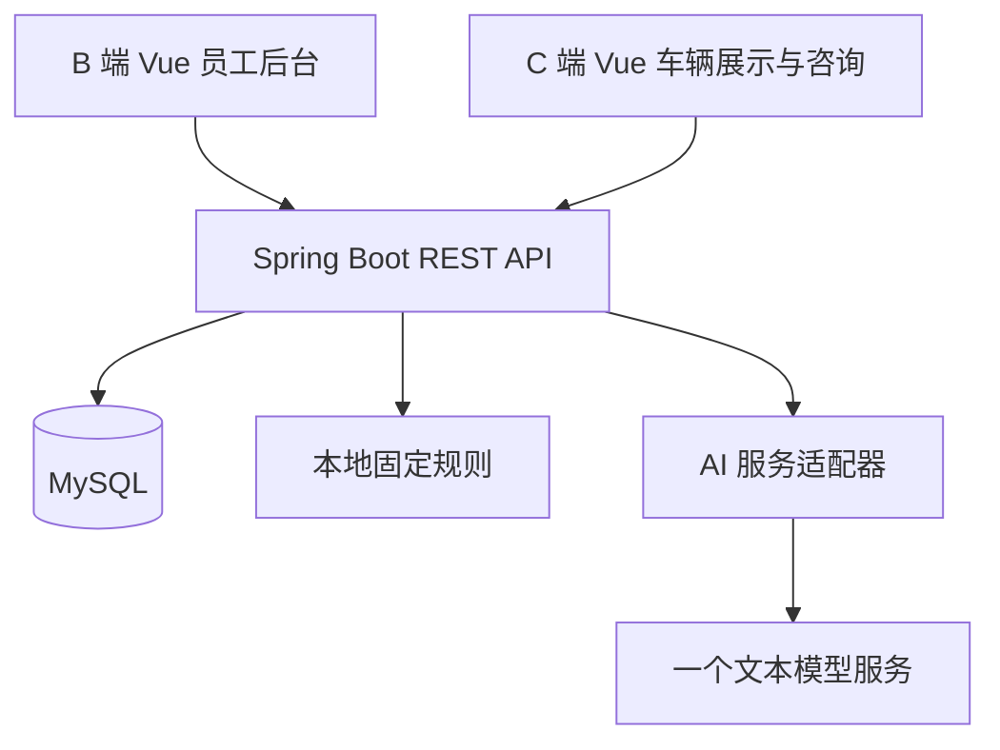
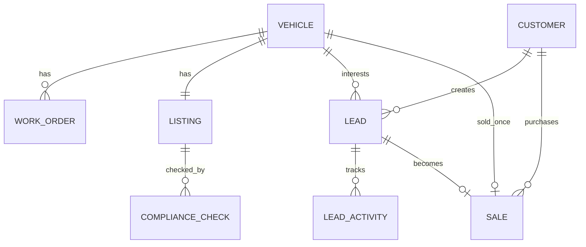

> 已废止的 v1.0 历史稿，不据此编码。请从 [当前文档索引](README.md) 阅读 00 业务设计与 07/08/09 微服务、DevOps、AI 组件设计。原始需求已找到并核实，不包含厂家或买家自助端。

# 架构与数据

## 技术决策

仅 Web：B 端后台和 C 端公开展示共用一个 Vue 应用，分别使用 AdminLayout 与 PublicLayout。后台默认桌面，C 端响应式适配手机浏览器。

技术基线：Java 21、Spring Boot、Spring Security、Spring Data JPA、Bean Validation、MySQL 8.4/InnoDB、Vue 3、Vue Router、Vite。前端使用团队熟悉的 JavaScript，不强制引入 TypeScript；表单样式统一使用一套 UI 组件。数据库变更通过 Flyway 管理。

Spring Boot 的具体受支持稳定版本以及前端依赖补丁号在初始化时检查兼容性后锁定；本阶段不声称已验证完整依赖组合。Java 21 是团队设计选择，不是要求所有库都使用最新主版本。

保留一个后端进程，不引入微服务、Redis、消息队列、搜索集群、向量数据库或 Kubernetes。普通 REST + JSON 即可；AI 检查用同步请求和超时处理。

## 模块和目录规划

未来一个仓库包含 frontend、backend、docs 三个目录。本次尚不创建运行项目。

后端按 auth、inventory、workorder、listing、compliance、crm、sales、dashboard 分包，各模块只有必要的 controller/service/repository/dto。业务状态和事务在 service 实现，不在 Vue 或 controller 中实现。

前端按 public、admin、auth、shared 分区。共享 api client、错误展示、分页组件和格式化函数。无需为 B/C 端创建两个独立构建系统。

经销商名称、公开联系方式、时区以及规则版本使用单店配置文件，MVP 不开发设置管理页面。配置发生变化时递增 dealerProfileVersion，既有广告检查及发布失效；所有当前 PUBLISHED 广告批量回 DRAFT，再由经理检查发布。通过一次维护事务完成，避免新配置与旧广告混合。

## 数据通用约定

- 主键 BIGINT，API 以字符串传递 ID，避免 JavaScript 大整数精度问题。
- 金额 DECIMAL(12,2)，Java BigDecimal，API 使用小数字符串；币种固定 CAD，不用浮点数计算。
- created_at、updated_at 使用 UTC DATETIME(3)；业务展示用 America/Toronto。
- 状态用 VARCHAR + Java enum；数据库约束或服务校验限定合法值。
- 可编辑主实体含 version INT，使用乐观锁；状态关键动作同时使用车辆行锁。
- 外键均 RESTRICT，MVP 无硬删除功能，不使用级联删除破坏成交及检查历史。
- 列表分页默认 20、最多 100；常用排序只接受允许的字段。

## 数据字典

所有表默认包含 id 与 created_at。只列业务字段；字符串长度是本版拟定限制，须同时用于前后端校验。

### 1. app_user

email VARCHAR(254) UNIQUE NOT NULL，password_hash VARCHAR(255)，display_name VARCHAR(80)，role VARCHAR(20)（MANAGER/STAFF），active BOOLEAN，updated_at。

两个角色、三个初始账号。创建和停用通过维护流程处理，页面不含人员管理。每个受保护请求检查 active，停用后旧会话也不能写入。

### 2. vehicle

stock_no VARCHAR(30) UNIQUE，vin CHAR(17) UNIQUE，make/model VARCHAR(60)，model_year SMALLINT，mileage_km INT，color VARCHAR(40)，base_price DECIMAL(12,2)，mandatory_fee_total DECIMAL(12,2)，photo_key VARCHAR(80)，status VARCHAR(20)，ready_note VARCHAR(500) nullable，internal_note VARCHAR(2000) nullable，created_by FK app_user，version，updated_at。

advertisedPrice 为 base_price + mandatory_fee_total，在服务端计算，不重复保存。费用细分不进入 MVP，mandatory_fee_total 为经销商录入的全部必收费用合计；系统无法证明其没有遗漏。

VIN 统一大写、去前后空格、17 位且不含 I/O/Q；只做格式检查，不做外部查询或校验位认证。年份范围 1980 至当前年 + 1。只支持现有库存普通二手车；不支持 as-is、unfit、融资/租赁或需特殊披露的交易广告。录入时人员确认适用范围，后端广告检查保留确认值。

索引：status、(make, model)、created_at；500 辆规模不需要全文索引。

### 3. work_order

vehicle_id FK vehicle，title VARCHAR(120)，description VARCHAR(2000)，assigned_to FK app_user nullable，status VARCHAR(20)，due_date DATE nullable，actual_cost DECIMAL(12,2) default 0，completion_note VARCHAR(1000) nullable，created_by FK app_user，version，updated_at。

索引 (vehicle_id,status)、(assigned_to,status)。实际成本只显示内部，不进入广告价格或利润统计。

### 4. listing

vehicle_id FK vehicle UNIQUE，title VARCHAR(120)，description VARCHAR(3000)，scope_confirmed BOOLEAN default false，status VARCHAR(20)，content_version INT default 1，published_check_id FK compliance_check nullable，published_by FK app_user nullable，published_at DATETIME(3) nullable，review_note VARCHAR(1000) nullable，version，updated_at。

vehicle 创建时同事务建立一个空 DRAFT listing，避免前端多一步初始化。草稿允许字段未填齐，但发布前必须检查。公开展示从已审核快照读取，且验证当前版本一致；不会读取独立变动的未审核自由文本。

version 用于数据库并发编辑；content_version 专用于广告相关内容变化，两者不要混淆。下架清除当前 published_* 和 review_note，历史发布事件保留在 audit_event。

### 5. compliance_check

listing_id FK listing，content_version INT，dealer_profile_version VARCHAR(30)，rule_version VARCHAR(30)，snapshot JSON，rule_results JSON，ai_status VARCHAR(20)（SUCCESS/UNAVAILABLE/INVALID_RESPONSE/MOCK），ai_results JSON nullable，provider VARCHAR(60) nullable，model VARCHAR(100) nullable，prompt_version VARCHAR(30)，duration_ms INT，created_by FK app_user，completed_at。

检查记录不可编辑。snapshot 保存生成广告所需的车辆、价格、描述、披露及经销商公开资料；不含客户、成本和 internal_note。rule_results 每项包含 ruleId、severity、field、message。AI 只存校验后的结构化结果，不保存未经约束的模型原始输出。

为避免双向建表问题，迁移先建 listing（暂不加 published_check_id 外键），再建 compliance_check，最后补外键。发布服务额外验证 check.listing_id 与当前 listing 一致。

### 6. customer

name VARCHAR(100)，email VARCHAR(254) nullable，phone VARCHAR(40) nullable，version，updated_at。至少一个联系方式，禁止全部为空。邮箱和电话不设 UNIQUE，不自动合并陌生访客。

客户没有密码和登录功能。内部新建线索可以选择已有 customer，复用客户信息。名称和联系信息只出现在授权 B 端响应。

### 7. lead

customer_id FK customer，vehicle_id FK vehicle，listing_id FK listing nullable，source VARCHAR(20)（WEB/MANUAL），stage VARCHAR(20)，owner_id FK app_user nullable，message VARCHAR(2000)，next_follow_up_at DATETIME(3) nullable，closed_reason VARCHAR(500) nullable，submission_key CHAR(36) UNIQUE nullable，version，updated_at。

WEB 请求使用 UUID submissionKey 去重；同一事务创建 customer + lead，唯一键冲突时回滚并返回既有提交成功的通用信息，不泄露记录。客户端网络重试沿用同一 key。MANUAL 不需要 submission_key。

索引 (vehicle_id,stage)、(owner_id,stage,next_follow_up_at)、customer_id。listing_id 的车辆必须与 vehicle_id 相同，由服务验证。

### 8. lead_activity

lead_id FK lead，actor_id FK app_user nullable，type VARCHAR(30)（NOTE/STAGE_CHANGED/ASSIGNED/SALE_RECORDED/AUTO_CLOSED），channel VARCHAR(20) nullable，note VARCHAR(2000)，previous_stage/next_stage VARCHAR(20) nullable。

仅追加，不编辑或删除。访客初始 message 保存在 lead；自动关闭事件由成交事务写入，actor_id 使用执行成交的经理。

### 9. sale

vehicle_id FK vehicle UNIQUE，lead_id FK lead UNIQUE，customer_id FK customer，recorded_by FK app_user，final_price DECIMAL(12,2)，sold_at DATETIME(3)，note VARCHAR(1000) nullable，vehicle_snapshot JSON。

不可编辑，vehicle_snapshot 保存成交当时车辆公开标识和价格信息；客户资料通过 FK 引用，不额外复制联系方式。final_price 是登记的税费前约定成交额，可与广告价格不同，差异必须在 note 说明；本版无税额、支付或利润字段。

vehicle_id UNIQUE 意味着本版同一车辆只经历一次销售，不支持回购重新销售。

### 10. audit_event

actor_id FK app_user nullable，entity_type VARCHAR(30)，entity_id BIGINT，action VARCHAR(40)，metadata JSON，created_at。

记录发布/下架、回整备、归档和成交等关键动作。只放 ID、版本、检查 ID、经理复核说明，不放完整客户联系方式、密码、密钥或任意原始请求。后台不单独开发日志页面，详情接口按需返回对应业务事件。

## 必须明确的事务

锁顺序统一为 vehicle → listing → lead（按 ID 升序）→ work_order，涉及多个对象的操作遵守顺序。长时间 AI 网络请求绝不能持有数据库行锁。

### 广告编辑与车辆编辑

锁 vehicle，再锁 listing；验证编辑 version。广告相关字段有变化时 content_version + 1，PUBLISHED 回 DRAFT 并清除发布字段，写审计。同事务更新，避免改价后旧广告仍公开。SOLD/ARCHIVED 拒绝修改。单独的内部备注更新不递增广告内容版本。

### 执行检查

短事务读取一致快照与版本后提交，事务外执行固定规则和 AI。结果写入新的不可变 check。即便当前版本已改变，结果也可保存为历史，但标记响应 stale=true。发布时必须重新核验版本与规则配置，不相信前端状态。

### 发布

锁 vehicle/listing，验证 AVAILABLE、无活动工单、指定 check 属于本广告、内容版本及经销商/规则版本仍一致、无 BLOCK、required acknowledgements 已提供；再写 PUBLISHED 与审核关联。发布只影响本站，无外部网络副作用。

### 访客咨询

先按 submission_key 检查重复；新请求锁 vehicle/listing 再确认可展示，创建 customer/lead 并提交。unique submission_key 处理竞争重复。成功响应不含内部记录 ID。售出后新的 key 必须被拒绝；旧 key 的网络重试仍返回通用成功，不新建数据。

### 成交

锁 vehicle/listing 和该车所有 open lead，核验车辆 AVAILABLE、当前 lead 非终态、客户/车辆关联一致、Manager 权限及请求 version。插入 sale → vehicle SOLD → listing CLOSED 并清除发布字段 → 选中 lead WON → 其他 open lead LOST（vehicle sold）→ 清除所有关闭线索 next_follow_up_at → 写 activity/audit，一并提交。任一步失败回滚。

所有线索状态变更、分配和备注动作也先锁关联 vehicle/lead，已售车辆的终态线索拒绝修改。数据库 sale 唯一键是并发成交的第二道约束。

## 认证和部署

使用 Spring Security 的服务器 session，Cookie 在演示 HTTPS 环境设 HttpOnly、Secure、SameSite=Lax；写接口使用 CSRF token，登录前从 /auth/csrf 获取，登录/退出后刷新。单实例无需 Redis session，重启要求重新登录是可接受的课程限制。

开发时 Vite 代理 /api 到 Java，避免手工跨域策略。演示构建将 Vue 静态文件打包到 Spring Boot，同域访问；SPA fallback 只用于页面路由，不覆盖 /api 的 404。一个后端服务和一个 MySQL 实例即可，AI 密钥只放后端环境变量。

数据库使用持久卷或明确的数据目录；每次里程碑导出数据库备份，最终演示前做一次恢复验证。本阶段不选购具体云服务。云环境可用时提供 HTTPS 演示地址；无云环境仍需可复现的本地演示。

公开咨询限制为每 IP 每分钟 5 次，并设置输入长度、请求体上限及简单隐藏字段检测；单实例限流足够本版，反向代理场景只信任配置过的代理 IP。不要为课程原型引入 CAPTCHA 账户依赖。

## 技术资料

- [Vue 3 官方介绍](https://vuejs.org/guide/introduction.html)：组件化界面与单文件组件基础。
- [Spring Boot 系统要求](https://docs.spring.io/spring-boot/system-requirements.html)：初始化时核对 Java 和构建工具兼容性。
- [MySQL 8.4 锁定读取](https://dev.mysql.com/doc/refman/8.4/en/innodb-locking-reads.html)：成交等事务采用 InnoDB 锁定读取设计。

查询日期：2026-09-09。以上用于技术依据，不表示软件已安装或验证。

