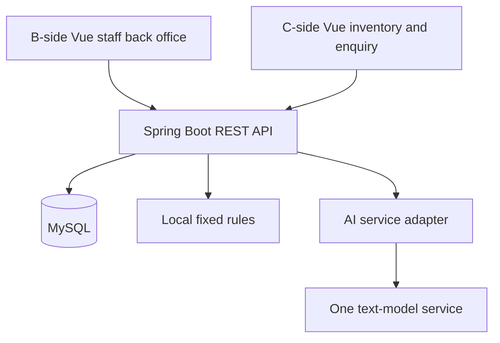
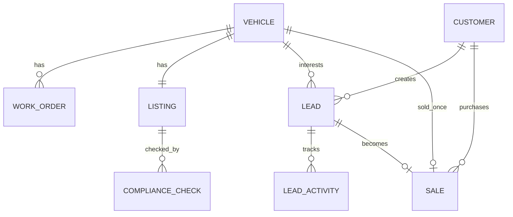

> Superseded v1.0 historical draft. Do not implement from this document. Read the current document index in [README.md](README.md) for the 00 business design and the 07/08/09 microservice, DevOps, and AI component designs. The original requirements have been located and verified; they do not include a manufacturer portal or a buyer self-service site.

# Architecture and data

## Technical decisions

Web only: the staff back office (B-side) and the public storefront (C-side) share one Vue app, using AdminLayout and PublicLayout respectively. The back office defaults to desktop; the C-side is responsive for mobile browsers.

Baseline: Java 21, Spring Boot, Spring Security, Spring Data JPA, Bean Validation, MySQL 8.4/InnoDB, Vue 3, Vue Router, Vite. The frontend uses JavaScript the team already knows; TypeScript is not required. Forms use one shared UI component set. Database changes are managed with Flyway.

The specific supported stable Spring Boot version and frontend dependency patch numbers are locked after a compatibility check at initialization; this stage does not claim a fully verified dependency set. Java 21 is a team design choice, not a requirement that every library use the latest major version.

Keep one backend process. Do not introduce microservices, Redis, a message queue, a search cluster, a vector database, or Kubernetes. Ordinary REST + JSON is enough; AI checks use a synchronous request with timeout handling.

## Module and directory plan

A future single repository contains frontend, backend, and docs. This pass does not create a runnable project.

The backend is packaged as auth, inventory, workorder, listing, compliance, crm, sales, dashboard. Each module has only the needed controller/service/repository/dto. Business state and transactions live in the service, not in Vue or the controller.

The frontend is partitioned as public, admin, auth, shared. Share the api client, error display, pagination component, and formatters. Do not create two independent build systems for B-side and C-side.

Dealer name, public contact, timezone, and rule version use a single-store config file; MVP has no settings-admin page. When configuration changes, increment dealerProfileVersion; existing advertisement checks and publishes become invalid; all currently PUBLISHED advertisements are bulk-returned to DRAFT and must be checked and published again by a manager. Do this in one maintenance transaction so new configuration is not mixed with old advertisements.

## Shared data conventions

- Primary keys are BIGINT; APIs pass IDs as strings to avoid JavaScript large-integer precision loss.
- Money is DECIMAL(12,2), Java BigDecimal; APIs use decimal strings. Currency is fixed CAD; do not compute with floating point.
- created_at and updated_at use UTC DATETIME(3); business display uses America/Toronto.
- Status is VARCHAR + Java enum; database constraints or service validation limit legal values.
- Editable main entities include version INT and use optimistic locking; status-critical actions also use a vehicle row lock.
- Foreign keys are all RESTRICT. MVP has no hard delete; do not use cascade delete that would destroy sale and check history.
- List pagination defaults to 20, maximum 100; common sorts accept only allowed fields.

## Data dictionary

All tables include id and created_at by default. Only business fields are listed; string lengths are this version’s proposed limits and must be used by both frontend and backend validation.

### 1. app_user

email VARCHAR(254) UNIQUE NOT NULL, password_hash VARCHAR(255), display_name VARCHAR(80), role VARCHAR(20) (MANAGER/STAFF), active BOOLEAN, updated_at.

Two roles, three seed accounts. Create and deactivate through a maintenance process; the UI has no people-admin page. Every protected request checks active; after deactivation an old session cannot write.

### 2. vehicle

stock_no VARCHAR(30) UNIQUE, vin CHAR(17) UNIQUE, make/model VARCHAR(60), model_year SMALLINT, mileage_km INT, color VARCHAR(40), base_price DECIMAL(12,2), mandatory_fee_total DECIMAL(12,2), photo_key VARCHAR(80), status VARCHAR(20), ready_note VARCHAR(500) nullable, internal_note VARCHAR(2000) nullable, created_by FK app_user, version, updated_at.

advertisedPrice is base_price + mandatory_fee_total, computed on the server, not stored twice. Fee breakdown is out of MVP; mandatory_fee_total is the dealer-entered total of all mandatory fees; the system cannot prove nothing was omitted.

VIN is uppercased, trimmed, 17 characters, and must not contain I/O/Q; format check only, no external lookup or check-digit certification. Year range is 1980 through current year + 1. Only ordinary used in-stock vehicles; no as-is, unfit, finance/lease, or ads that need special disclosure. Staff confirm the scope at entry; the backend advertisement check keeps that confirmation.

Indexes: status, (make, model), created_at; at 500 vehicles a full-text index is not needed.

### 3. work_order

vehicle_id FK vehicle, title VARCHAR(120), description VARCHAR(2000), assigned_to FK app_user nullable, status VARCHAR(20), due_date DATE nullable, actual_cost DECIMAL(12,2) default 0, completion_note VARCHAR(1000) nullable, created_by FK app_user, version, updated_at.

Indexes (vehicle_id,status), (assigned_to,status). Actual cost is internal only and does not enter advertisement price or profit statistics.

### 4. listing

vehicle_id FK vehicle UNIQUE, title VARCHAR(120), description VARCHAR(3000), scope_confirmed BOOLEAN default false, status VARCHAR(20), content_version INT default 1, published_check_id FK compliance_check nullable, published_by FK app_user nullable, published_at DATETIME(3) nullable, review_note VARCHAR(1000) nullable, version, updated_at.

When a vehicle is created, the same transaction creates an empty DRAFT listing so the frontend does not need a separate init step. A draft may have incomplete fields, but it must be checked before publish. Public display reads from the reviewed snapshot and verifies the current version still matches; it does not read independently changing unchecked free text.

version is for concurrent database edits; content_version is only for advertisement-related content changes — do not confuse them. Unpublish clears the current published_* and review_note; historical publish events remain in audit_event.

### 5. compliance_check

listing_id FK listing, content_version INT, dealer_profile_version VARCHAR(30), rule_version VARCHAR(30), snapshot JSON, rule_results JSON, ai_status VARCHAR(20) (SUCCESS/UNAVAILABLE/INVALID_RESPONSE/MOCK), ai_results JSON nullable, provider VARCHAR(60) nullable, model VARCHAR(100) nullable, prompt_version VARCHAR(30), duration_ms INT, created_by FK app_user, completed_at.

Check records are not editable. snapshot stores the vehicle, price, description, disclosures, and dealer public profile needed to render the ad; it excludes customer, cost, and internal_note. Each rule_results item includes ruleId, severity, field, message. AI stores only validated structured results, not unconstrained raw model output.

To avoid a circular create problem, migrations first create listing (without the published_check_id FK), then compliance_check, then add the FK. The publish service also verifies check.listing_id matches the current listing.

### 6. customer

name VARCHAR(100), email VARCHAR(254) nullable, phone VARCHAR(40) nullable, version, updated_at. At least one contact method; all-empty is forbidden. Email and phone are not UNIQUE; unknown visitors are not auto-merged.

Customers have no password and no login. An internally created lead may select an existing customer and reuse that information. Name and contact appear only in authorized B-side responses.

### 7. lead

customer_id FK customer, vehicle_id FK vehicle, listing_id FK listing nullable, source VARCHAR(20) (WEB/MANUAL), stage VARCHAR(20), owner_id FK app_user nullable, message VARCHAR(2000), next_follow_up_at DATETIME(3) nullable, closed_reason VARCHAR(500) nullable, submission_key CHAR(36) UNIQUE nullable, version, updated_at.

WEB requests use a UUID submissionKey for de-duplication; the same transaction creates customer + lead. On unique-key conflict roll back and return a generic success for an existing submission, without leaking the record. Client network retries reuse the same key. MANUAL does not need submission_key.

Indexes (vehicle_id,stage), (owner_id,stage,next_follow_up_at), customer_id. The listing_id vehicle must match vehicle_id; the service validates this.

### 8. lead_activity

lead_id FK lead, actor_id FK app_user nullable, type VARCHAR(30) (NOTE/STAGE_CHANGED/ASSIGNED/SALE_RECORDED/AUTO_CLOSED), channel VARCHAR(20) nullable, note VARCHAR(2000), previous_stage/next_stage VARCHAR(20) nullable.

Append-only; no edit or delete. The visitor’s initial message is stored on lead; auto-close events are written by the sale transaction, with actor_id set to the manager who recorded the sale.

### 9. sale

vehicle_id FK vehicle UNIQUE, lead_id FK lead UNIQUE, customer_id FK customer, recorded_by FK app_user, final_price DECIMAL(12,2), sold_at DATETIME(3), note VARCHAR(1000) nullable, vehicle_snapshot JSON.

Not editable. vehicle_snapshot stores the vehicle’s public identifiers and price at sale time; customer data is referenced by FK and contact details are not copied. final_price is the registered pre-tax agreed sale amount; it may differ from the advertised price, and the difference must be explained in note. This version has no tax, payment, or profit fields.

vehicle_id UNIQUE means a vehicle is sold only once in this version; buy-back and resale are not supported.

### 10. audit_event

actor_id FK app_user nullable, entity_type VARCHAR(30), entity_id BIGINT, action VARCHAR(40), metadata JSON, created_at.

Records publish/unpublish, return to preparation, archive, sale, and similar key actions. Store only IDs, versions, check IDs, and manager review notes — not full customer contact, passwords, secrets, or arbitrary raw requests. The back office has no dedicated log page; detail APIs return the related business events as needed.

## Transactions that must be explicit

Lock order is always vehicle → listing → lead (by ID ascending) → work_order. Operations that touch multiple objects follow that order. A long AI network request must never hold a database row lock.

### Advertisement edit and vehicle edit

Lock vehicle, then listing; verify the edit version. When advertisement-related fields change, content_version + 1, PUBLISHED returns to DRAFT, publish fields are cleared, and an audit is written. Update in the same transaction so an old advertisement cannot stay public after a price change. SOLD/ARCHIVED reject edits. An internal-note-only update does not increment advertisement content version.

### Run checks

A short transaction reads a consistent snapshot and version, then commits; fixed rules and AI run outside the transaction. Results are written as a new immutable check. Even if the current version has already changed, the result may be stored as history, but the response is marked stale=true. Publish must re-verify version and rule configuration and must not trust frontend state.

### Publish

Lock vehicle/listing; verify AVAILABLE, no active work orders, the specified check belongs to this advertisement, content version and dealer/rule versions still match, no BLOCK, and required acknowledgements are present; then write PUBLISHED and the review association. Publish affects only this site; there are no external network side effects.

### Visitor enquiry

First check duplicates by submission_key; for a new request lock vehicle/listing, confirm it is still displayable, create customer/lead, and commit. Unique submission_key handles race duplicates. A success response contains no internal record IDs. After a sale a new key must be rejected; a network retry of an old key still returns generic success and creates no new data.

### Sale

Lock vehicle/listing and all open leads for that vehicle; verify the vehicle is AVAILABLE, the current lead is not terminal, customer/vehicle association matches, Manager permission, and request versions. Insert sale → vehicle SOLD → listing CLOSED and clear publish fields → selected lead WON → other open leads LOST (vehicle sold) → clear next_follow_up_at on all closed leads → write activity/audit, then commit together. Any step failure rolls back.

Lead stage changes, assignment, and notes also lock the related vehicle/lead first; terminal leads on a sold vehicle reject edits. The database sale unique key is the second constraint against concurrent sales.

## Authentication and deployment

Use Spring Security server sessions. In a demo HTTPS environment the cookie is HttpOnly, Secure, SameSite=Lax; write endpoints use a CSRF token obtained from /auth/csrf before login, and refreshed after login/logout. A single instance needs no Redis session; requiring re-login after restart is an acceptable course constraint.

In development Vite proxies /api to Java so CORS is not hand-tuned. The demo build packs Vue static files into Spring Boot for same-origin access; SPA fallback is only for page routes and must not cover /api 404s. One backend service and one MySQL instance are enough; the AI key lives only in backend environment variables.

The database uses a persistent volume or an explicit data directory; export a database backup at each milestone and run one restore verification before the final demo. This stage does not purchase a specific cloud service. When cloud is available, provide an HTTPS demo URL; without cloud, a reproducible local demo is still required.

Public enquiry is limited to 5 requests per IP per minute, plus input-length, request-body limits, and a simple hidden-field check. Single-instance rate limiting is enough for this version; in a reverse-proxy setup trust only configured proxy IPs. Do not add a CAPTCHA-account dependency for a course prototype.

## Technical references

- [Vue 3 introduction](https://vuejs.org/guide/introduction.html): component UI and single-file component basics.
- [Spring Boot system requirements](https://docs.spring.io/spring-boot/system-requirements.html): check Java and build-tool compatibility at initialization.
- [MySQL 8.4 locking reads](https://dev.mysql.com/doc/refman/8.4/en/innodb-locking-reads.html): sale and similar transactions use InnoDB locking reads.

Retrieved: 2026-09-09. These are technical sources, not a claim that the software is already installed or verified.
