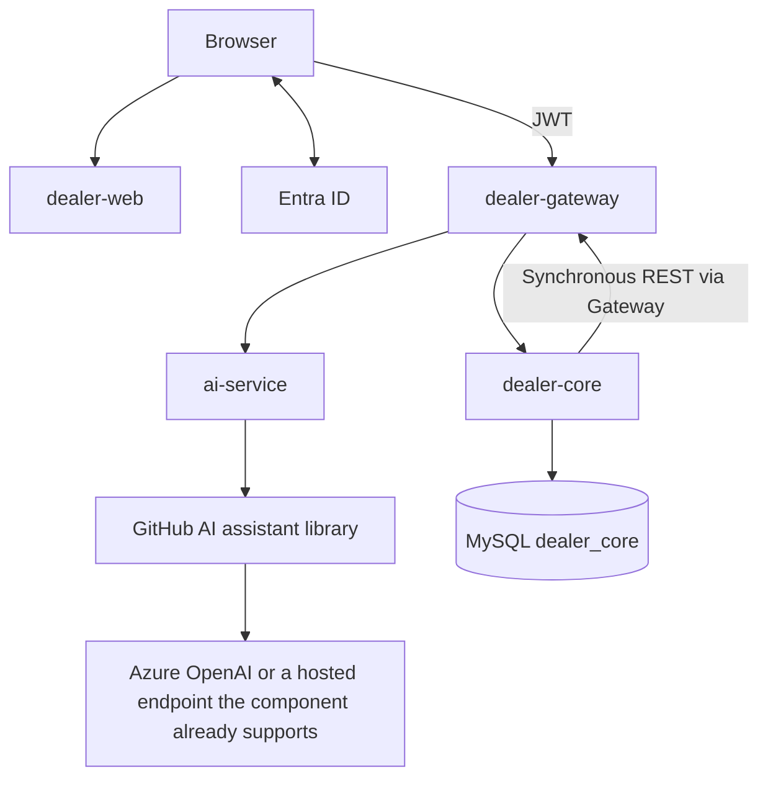

# Architecture (minimum that still meets course hard requirements)

Version v6.0 · 2026-09-21

Four independent repositories, four independent pipelines, four images. Browser and service-to-service HTTP both go through the Gateway. AI uses synchronous REST, not a queue.

| PPT domain | Unit | Technology | Owner |
|---|---|---|---|
| UI | dealer-web | Vue 3 + MSAL.js | A |
| Auth | Microsoft Entra ID | OAuth 2.0 / OIDC + PKCE, JWT | C configures |
| Data | dealer-core | Java 21 Spring Boot + Flyway + one MySQL | C |
| AI | ai-service | Java 21 Spring Boot, embeds the GitHub AI library, no database | B |
| Entry | dealer-gateway | Spring Cloud Gateway | C, A reviews |

core and ai-service are not public; only the Gateway may reach them. Bypassing the Gateway must fail. Sprint 1 must be able to walk through this diagram.

## Identity

There are only two roles: `Platform.Admin` and `Dealer.User`.  
Passwords are not stored. An administrator binds `entra_oid` to `dealer_id`. Each request uses the JWT role plus local membership and ignores any dealership ID sent by the frontend.

## Data (one database)

`dealer`, `membership`, `app_user`, `vehicle`, `customer`, `customer_vehicle`, `listing`, `compliance_check`, `audit_event`.  
Business tables include `dealer_id`. Vehicles and customers must share this database. Administrator queries must not join vehicles or customers.

The AI service has no database: it calls the GitHub assistant library in-process. core sends public vehicles + advertisement text + the dealership’s public profile to ai-service, then writes missing items and explanations into `compliance_check`. Assistant Q&A is likewise filtered by core before it reaches that library.

## How a check runs

1. A dealership user POSTs `/api/v1/listings/{id}/checks` (via the Gateway).
2. core validates this dealership and the version, calls ai-service (via the Gateway), and waits at most 15 seconds.
3. The fixed checklist runs first; Azure OpenAI is called only if there is no hard block.
4. Results are stored in core. On failure the status is `UNAVAILABLE` and the page cannot click through as a pass.
5. After a pass, POST export and download TXT.

Do not use Service Bus, outbox, DLQ, or a second database. Do not deploy the GitHub component as a fifth container.

## Minimum Azure set

One resource group: Container Apps × 4, one MySQL, ACR, Key Vault, Application Insights, created with Bicep.  
MySQL uses the private network. HTTPS. Secrets go in Key Vault. Platform encryption left on is enough; do not add a complex network.  
One demo environment is enough; develop locally with Docker Compose.

## Acceptance

- Deploy only ai-service; web/core/gateway images stay unchanged.
- The browser can reach only the Gateway.
- A dealership A token against dealership B returns 404.
- An administrator cannot see vehicles.
- On Azure, walk through: open a dealership → record a vehicle → record a customer → real AI check → export.
