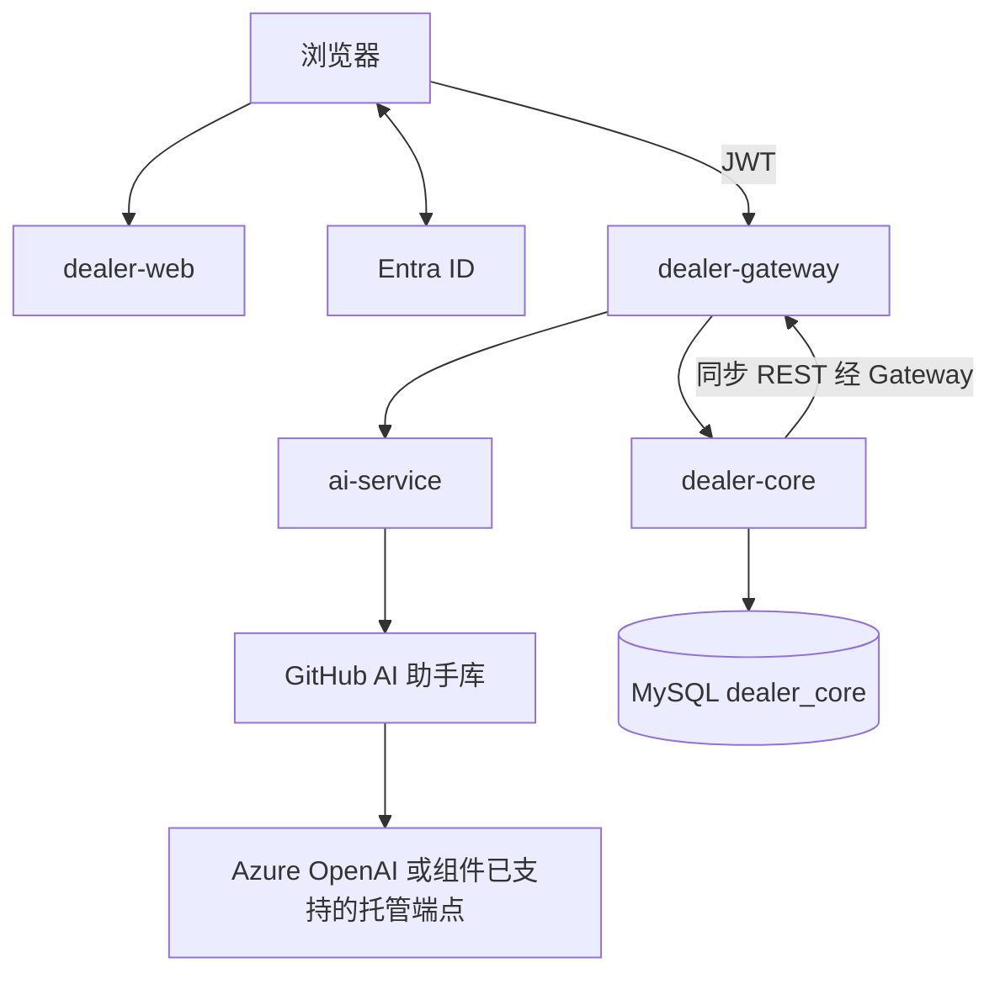

# 架构（最简，仍过课程硬项）

版本 v6.0 · 2026-09-21

四个独立仓库、四个独立流水线、四个镜像。浏览器和服务间 HTTP 都走 Gateway。AI 用同步 REST，不用队列。

| PPT 域 | 单元 | 技术 | 谁负责 |
|---|---|---|---|
| UI | dealer-web | Vue 3 + MSAL.js | A |
| Auth | Microsoft Entra ID | OAuth 2.0 / OIDC + PKCE，JWT | C 配置 |
| Data | dealer-core | Java 21 Spring Boot + Flyway + 一个 MySQL | C |
| AI | ai-service | Java 21 Spring Boot，内嵌 GitHub AI 库，无数据库 | B |
| 入口 | dealer-gateway | Spring Cloud Gateway | C，A 评审 |

core 与 ai-service 不对外开放，只让 Gateway 进来。绕过 Gateway 必须失败，Sprint 1 能讲这张图。

## 身份

角色只有两个：`Platform.Admin`、`Dealer.User`。  
不存密码。管理员绑定 `entra_oid` 到 `dealer_id`。每个请求用 JWT 角色 + 本地 membership，忽略前端传来的店 ID。

## 数据（一张库）

`dealer`、`membership`、`app_user`、`vehicle`、`customer`、`customer_vehicle`、`listing`、`compliance_check`、`audit_event`。  
业务表带 `dealer_id`。车辆和客户必须同库。管理员查询不准 join 车辆/客户。

AI 服务不建库：内部调用 GitHub 助手库。core 把公开车辆 + 广告文本 + 店公开资料发给 ai-service，回缺失项和说明后写入 `compliance_check`。助手问答同样经 core 过滤后再进该库。

## 检查怎么走

1. 店员 POST `/api/v1/listings/{id}/checks`（经 Gateway）。
2. core 校验本店和版本，调 ai-service（经 Gateway），等最多 15 秒。
3. 固定清单先跑；没有硬阻断再调 Azure OpenAI。
4. 结果存 core。失败则 `UNAVAILABLE`，页面不能点通过。
5. 通过后 POST export，下载 TXT。

不用 Service Bus、outbox、DLQ、第二库。不把 GitHub 组件单独做成第五个容器。

## Azure 最小集合

一个资源组：Container Apps × 4、一个 MySQL、ACR、Key Vault、Application Insights、Bicep 建出来。  
MySQL 走私网。HTTPS。密钥进 Key Vault。平台加密开着即可，不另做复杂网络。  
demo 环境一套就够；本地 Docker Compose 开发。

## 验收

- 只发 ai-service，web/core/gateway 镜像不变。
- 浏览器只能打 Gateway。
- 店 A token 打店 B 返回 404。
- 管理员看不到车辆。
- Azure 上走通：开店 → 录车 → 录客户 → 真实 AI 检查 → 导出。
